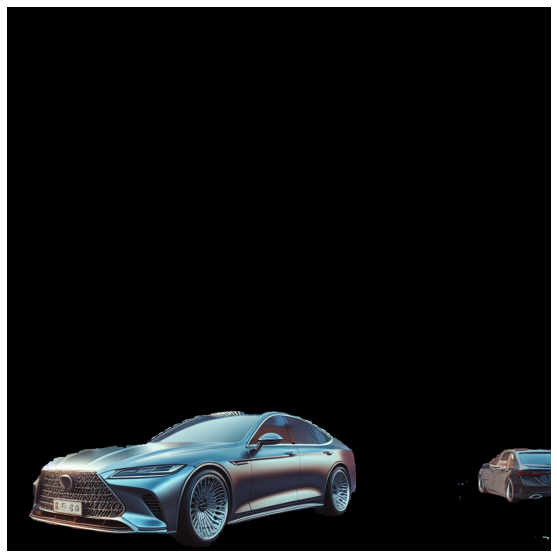

# SAM_AND_GPT

入力した画像に対して，SAMによるセグメンテーションを実施して，GPT4-oでラベリング，更にはcroppingを行うツールです．

This is a tool that performs segmentation by SAM on the input image, labels it with GPT4-o, and further performs cropping.

## 実行例

以下のような画像を入力すると，

以下のようにSAMによるセグメンテーションと番号付けを実行できます．

さらにGPT4oでラベリングを行い，任意のラベルに対してcroppingを行うことができます．

## 使い方

[notebook](./notebooks/sam_and_gpt.ipynb)を参照ください．

